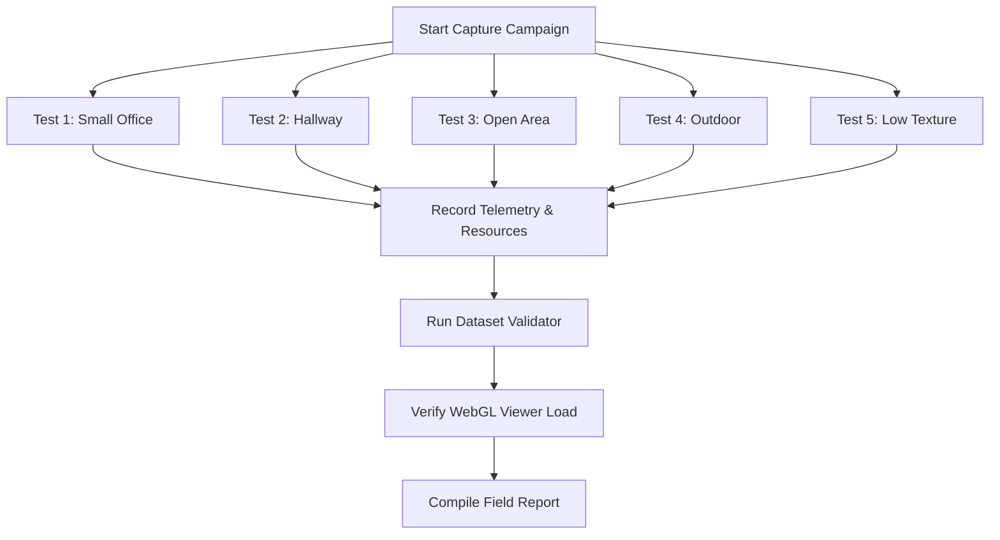

# ScanAR G — V2 Field Validation Campaign Framework
This document defines the formal testing protocols and reporting templates for the V2 Field Capture MVP campaign. All engineering focus is frozen on empirical measurements from real-world headset captures.

---

## 1. Campaign Objectives
To validate that an operator can wear the VITURE Luma Ultra glasses connected to the Jetson Orin NX, walk through representative real-world environments, and reliably export a verified 3D Gaussian splat dataset under real-world conditions.

---

## 2. Test Scenarios & Protocols



### 🏢 Test 1: Small Office (Closed-Loop Tracking)
*   **Description**: Walk along the room perimeter, trace a central figure-8 path, and return to the exact starting location.
*   **Duration**: 3–5 minutes.
*   **Key Validation Metric**: Loop closure error (translation difference between start and end pose).

### 🛣️ Test 2: Hallway (Structural Monotony)
*   **Description**: Walk down a long, narrow corridor and walk back.
*   **Duration**: 2–3 minutes.
*   **Key Validation Metric**: Scale drift and corridor-effect z-axis translation drift.

### 🏛️ Test 3: Large Open Area (Feature Sparsity)
*   **Description**: Walk across an open gymnasium, warehouse, or double-height lobby.
*   **Duration**: 5–8 minutes.
*   **Key Validation Metric**: Feature matching reliability on distant surfaces; Gaussian map density limits.

### 🌳 Test 4: Outdoor Path (Dynamic Exposure)
*   **Description**: Walk along a sidewalk flanked by buildings and trees under natural sunlight.
*   **Duration**: 3–5 minutes.
*   **Key Validation Metric**: Auto-exposure convergence latency; tracking recovery during sun-to-shadow transitions.

### 🧱 Test 5: Low-Texture Room (Failure Limits)
*   **Description**: Walk in a windowless room with flat white walls, minimal furniture, and uniform fluorescent lighting.
*   **Duration**: 1–2 minutes.
*   **Key Validation Metric**: Tracking recovery latency; duration of tracking loss periods.

---

## 3. Standard Field Test Report Template

Every campaign capture must be documented using the following template:

```markdown
### Capture ID: [e.g. Capture_001_1a2b3c4d]
*   **Environment**: [Small Office | Hallway | Open Area | Outdoor | Low Texture]
*   **Operator**: [Name]
*   **Date & Time**: [YYYY-MM-DD HH:MM:SS]

#### 1. Session Telemetry
| Metric | Measured Value | Target Threshold | Status |
| :--- | :--- | :--- | :--- |
| **Duration** | [X] sec | < 600 sec | [PASS/FAIL] |
| **Total Frames** | [X] frames | - | - |
| **Average Frame Rate** | [X.X] FPS | >= 25 FPS | [PASS/FAIL] |
| **Tracking Loss Events**| [X] | <= 1 | [PASS/FAIL] |
| **Relocalization Time** | [X.XX] sec | < 2.0 sec | [PASS/FAIL] |

#### 2. Resource & Thermals Profile
| Metric | Mean Value | Peak Value | Safety Bound | Status |
| :--- | :--- | :--- | :--- | :--- |
| **CPU Load** | [X]% | [X]% | < 90% | [PASS/FAIL] |
| **GPU Load** | [X]% | [X]% | < 95% | [PASS/FAIL] |
| **Shared VRAM** | [X.X] GB | [X.X] GB | < 14.5 GB | [PASS/FAIL] |
| **Core Temp** | [X.X]°C | [X.X]°C | < 78.0°C | [PASS/FAIL] |

#### 3. Dataset & Export Deliverables
*   **Splat File Size**: [X.XX] KB (Must be a multiple of 32 bytes)
*   **PLY File Size**: [X.XX] KB
*   **Active Gaussian Count**: [X,XXX] splats
*   **Dataset Validator Score**: [X]%
*   **WebGL Viewer Load**: [SUCCESS / FAILED] (Verified on antimatter15 or custom web player)

#### 4. Operator Notes
*   *UI Usability*: [Describe any lag, button delay, or screen readability issues]
*   *Environmental Conditions*: [Describe lighting levels, sun glare, wall texture, walking speed]
*   *Observed Failure Modes*: [Describe any tracking jitter or map deformation]
```
